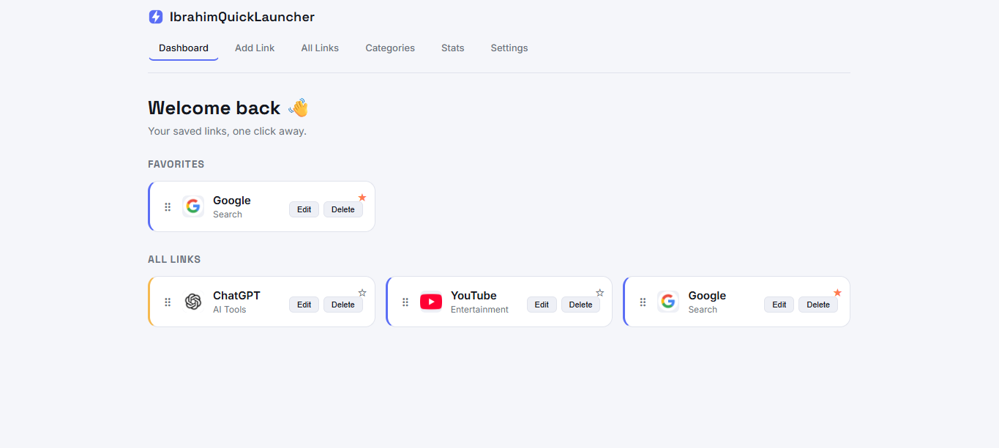
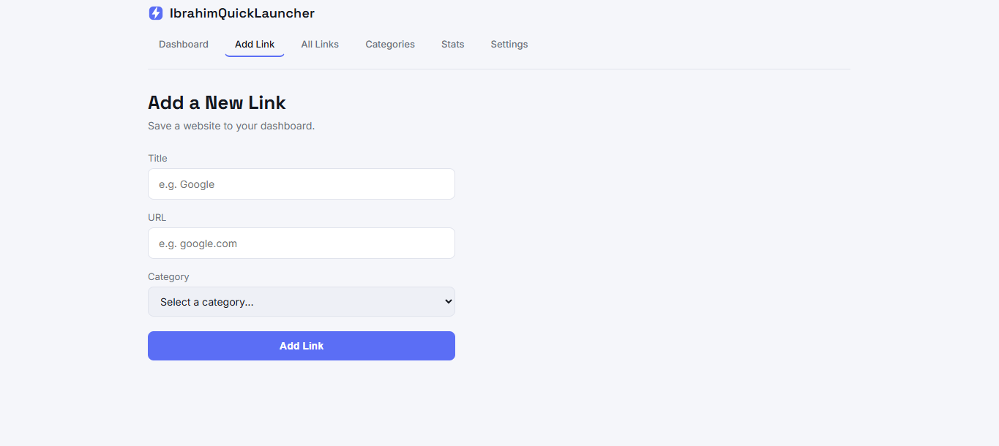
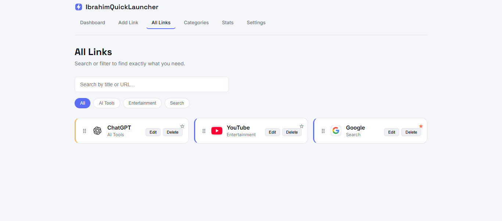
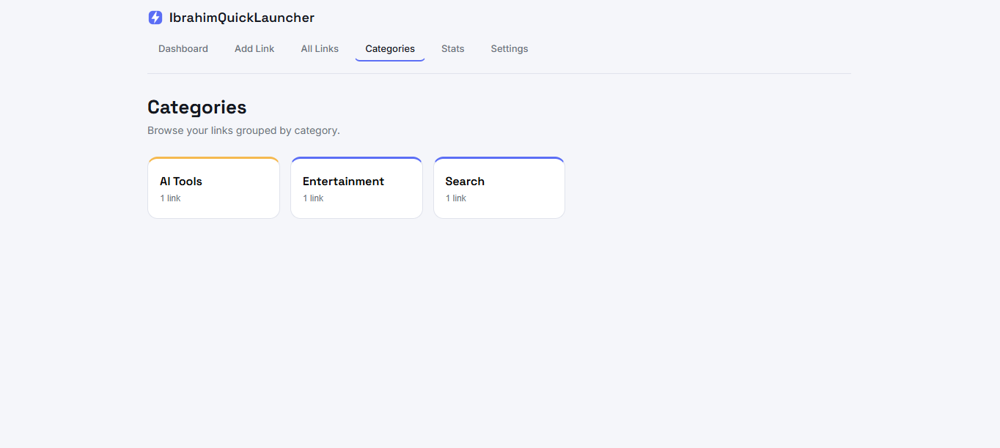
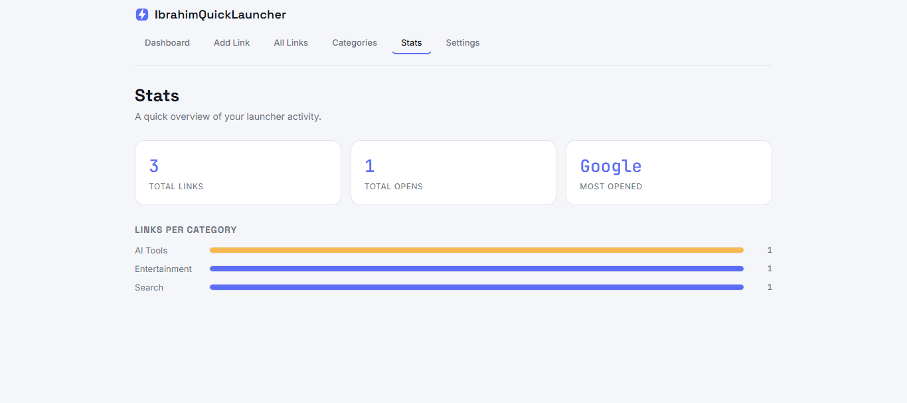
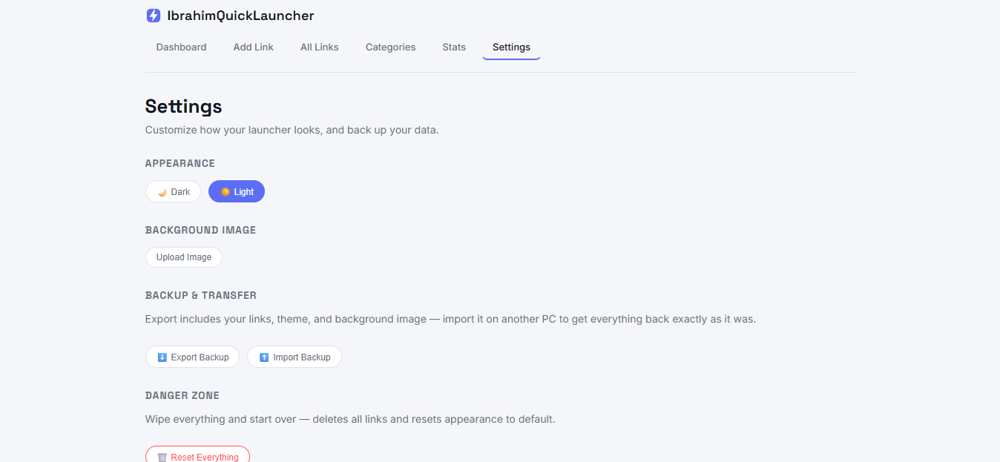
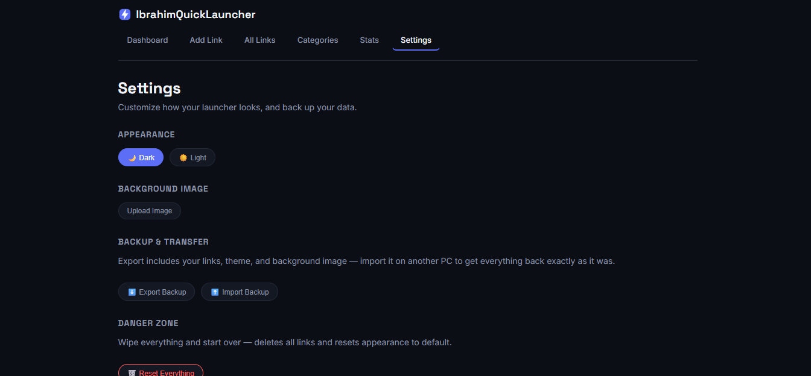

# IbrahimQuickLauncher

A quick-access web app for saving and organizing frequently visited websites. Add a URL, and the app automatically fetches the site's icon and displays it as a clickable tile — like a personal home screen for your favorite sites.

Built for CSCI390: Web Programming.

## Features

- **Dashboard** — favorites section (if any) + all links as cards
- **Add Link** — save a new site with title, URL, and category (auto-adds `https://` if missing; pick an existing category or create a new one)
- **All Links** — search bar + category filter chips
- **Categories** — each category shown as a card with a link count; click one to jump to All Links pre-filtered
- **Stats** — total links, total opens, most-opened link, and a live breakdown of links per category
- **Settings** —
  - Light/dark theme toggle (applies to the whole app)
  - Custom background image upload
  - Export your links + theme + background as a backup file, and import it back
  - "Reset Everything" — restores the 3 starting demo links with stats cleared
- Drag-and-drop reordering — grab the grip handle on any card to reorder your links
- Every category gets a consistent, auto-generated color across the whole app
- Favicons fetched live via Google's public favicon service — no API key needed
- All data (links, theme, background) saved automatically in the browser's local storage — no backend required
- Fully responsive — collapses into a hamburger menu under 640px width

## Tech Stack

- React (built with Vite)
- Plain CSS with CSS variables (custom design system, no external UI framework)
- Browser `localStorage` for persistence (no backend/database)

## Setup Instructions

1. Clone the repository:
   ```bash
   git clone <your-repo-url>
   cd IbrahimQuickLauncher
   ```
2. Install dependencies:
   ```bash
   npm install
   ```
3. Run the development server:
   ```bash
   npm run dev
   ```
4. Open the local link shown in the terminal (usually `http://localhost:5173`) in your browser.

## Build for Production

```bash
npm run build
```

## Live Demo

https://ibrahim-quick-launcher.vercel.app

## Screenshots

## Screenshots

**Dashboard**


**Add Link**


**All Links**


**Categories**


**Stats**


**Settings — Light Mode**


**Settings — Dark Mode**


## Author

Ibrahim Shb — CSCI390 Web Programming
